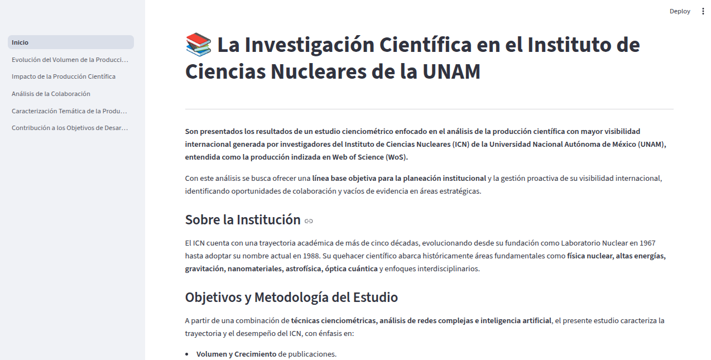
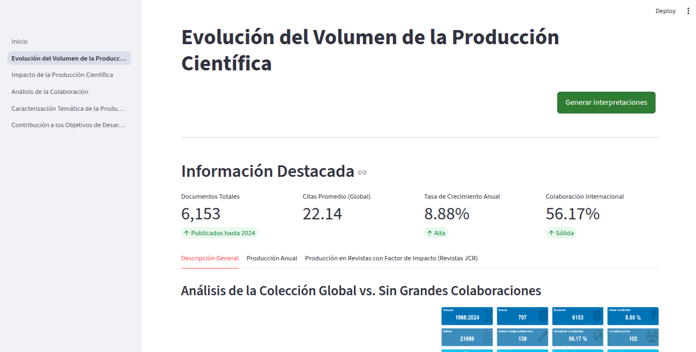
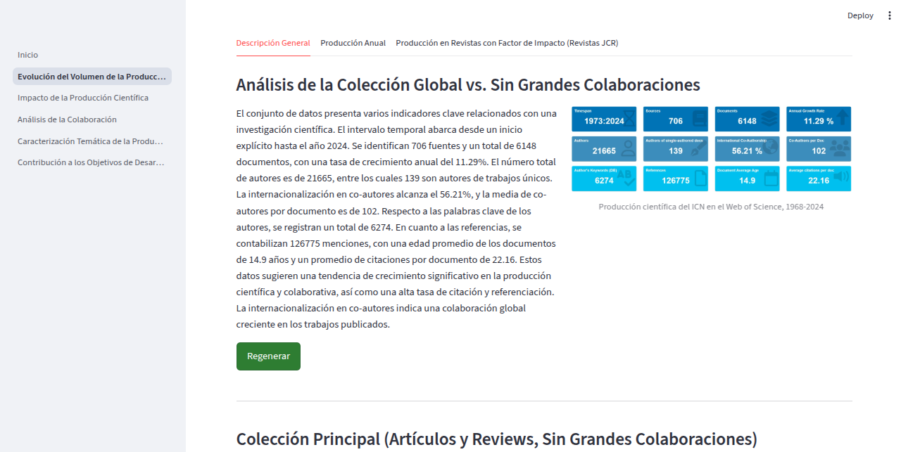
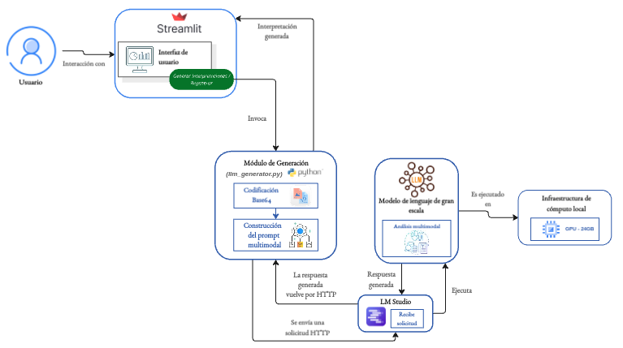

# Aplicación de Modelos de Lenguaje al Análisis de Datos Visuales Cienciométricos


Un sistema desarrollado con **Streamlit** que automatiza el análisis e interpretación de datos visuales bibliométricos complejos. La plataforma actúa como un puente entre visualizaciones científicas complejas y la interpretación de datos. 

Con el objetivo de realizar dicho análisis, se integró de forma local al modelo de lenguaje de gran escala (LLM) **Pixtral-12b** para traducir patrones visuales.

El sistema permite a los usuarios navegar de forma fluida a través de las secciones o páginas que lo conforman, además de solicitar el análisis visual y la generación de las interpretaciones. 

Aunque este repositorio se encuentra validado con gráficos cienciométricos del *Instituto de Ciencias Nucleares (ICN - UNAM)*, el frontend está estructurado para recibir, renderizar e interpretar gráficos de cualquier otro dominio analítico sin romper la aplicación.







---

## Características Clave

- **Gestión Dinámica de Estado:** La memoria de la interfaz preserva las interpretaciones generadas por el LLM entre pestañas y re-renderizados de la página.

- **Regeneración Asíncrona y Selectiva:** Junto a cada bloque de texto generado por el LLM, se programó un activador con claves únicas que permite limpiar el estado de un componente específico y volver a consultar al modelo para que realice otro análisis e interpretación.

- **Estructuración Determinista de Prompts:** Fue creado un prompt basado en roles o *role prompting*, buscando una redacción consistente con los datos visuales y eliminando texto meta-discursivo.

---

## Arquitectura del Sistema



---

## Estructura del Proyecto

```text
├── Inicio.py               # Landing page y contexto general del reporte

├── requirements.txt        # Registro de dependencias de ejecución del sistema

├── llm/    # Comunicación con el LLM (Cliente HTTP)
│   └── llm_generator.py   

├── pages/  # Secciones analíticas divididas por pestañas dinámicas

│   └── 1_Evolución_del_Volumen_de_la_Produccion_Científica.py
    └── 2_Impacto_de_la_Produccion_Científica.py
    └── 3_Análisis_de_la_Colaboración.py
    └── 4_Caracterización_Temática_de_la_Producción_Científica.py
    └── 5_Contribución_a_los_Objetivos_de_Desarrollo_Sostenible_(ODS).py  
└── assets/
    └── images/             # Datos visuales a analizar
```

---

## Instalación y Ejecución

### Prerrequisitos
- Python 3.10+
- Un servidor activo que aloje un modelo multimodal (localmente vía **LM Studio**).

### Pasos para levantar el proyecto

1. **Clonar el repositorio:**
   ```bash
   git clone https://github.com/avdeloya13/Proyecto-Informe-Cienciometrico.git
   cd Proyecto-Informe-Cienciometrico
   ```

2. **Instalar dependencias:**
   ```bash
   pip install -r requirements.txt
   ```

3. **Ejecutar la aplicación web:**
   ```bash
   streamlit run Inicio.py
   ```
